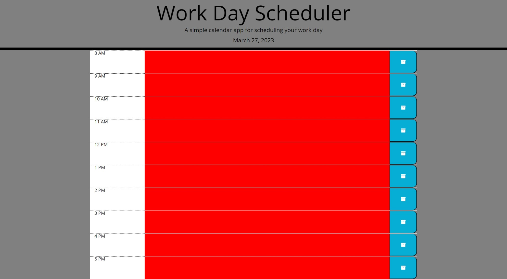

# Work-Day-Scheduler

This week I made a simple work day scheduler using a mix of html, css and javascript.

Centering the header was the first task then adding a jquery link to the html.

Adding the current date was done through js with a for loop and if else statements along with color coding for for past, present and future depending on the time of day.

Each hour has an input box for typing your task if any with also a functioning save button that will save each task using local storage in js.

git status